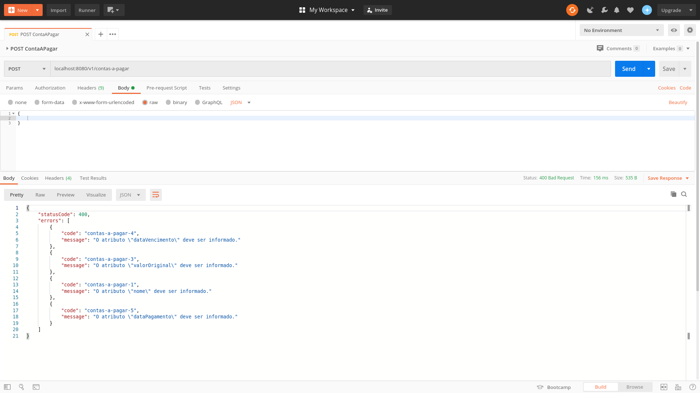

# API REST Gerenciamento de Contas A Pagar

## Funcionalidades

### Inclusão de Conta A Pagar

1. Ao tentar salvar passando um objeto Json vazio no payload de request, é retornado um código Http de erro `400 Bad Request` com um array de mensagens solicitando os atributos obrigatórios.

  

2. Ao tentar salvar passando um atributo inválido no payload de request, é retornado um código Http de erro `400 Bad Request` com a mensagem `Payload do request invalido`.

3. Ao tentar salvar passando um payload de request válido, onde a **Conta a Pagar** não está em atraso, é retornado um código Http `201 Created` com o payload de response.

4. Ao tentar salvar passando um payload de request válido, onde a **Conta a Pagar** está em atraso de 5 dias, é retornado um código Http `201 Created` com o payload de response.

### Listagem das Contas Cadastradas

1. Ao buscar a lista de Contas Cadastradas, é retornado um código Http `200 OK` com o payload de response.

### Hateoas

Foi aplicado Hateoas na API. Assim, para cada Post, no atributo `Location` do `Header` do response, é enviado o endereço de recuperação do recurso recém criado.

### Versionamento da API

A estratégia utilizada para o versionamento da API foi versionar pelo `path da URI`, ou seja, incluir o número da versão ao `path na URI`.

### Arquitetura

A API segue um padrão de arquitetura `MVC (Model-View-Controller)`.

Na camada `Model`, estão as classes do pacote `.model` e `.repository` para integração com a camada de persistência.

Na camada `View`, estão as classes do pacote `.resource` para integração com a camada web através da definição dos endpoints.

Na camada `Controller`, estão as classes do pacote `.service` para integração com a camada de serviços/negócios.

### Persistência

Foi utilizado o banco de dados [MySQL](https://www.mysql.com/) para a persistência dos dados da aplicação e, como ferramenta de migração de banco de dados, foi utilizado o [Flyway](https://flywaydb.org/).

### Tratamento de Erros e Exceções

O tratamento de erros e exceções foi desenvolvido conforme o estudo proposto por Ali Dehghani em [RESTful API Design: How to handle errors?](https://alidg.me/blog/2016/9/24/rest-api-error-handling).

### Uso de Testes Automatizados e Ferramentas de Qualidade

Para os testes automatizados, foram implementadas classes de testes unitários para a camada web, ou seja, classes no pacote `.resource` e de serviços/negócios, ou seja, classes no pacote `.service`. Também foi implementada classe para testes de integração, passando por todas as camadas da API: `web, serviços e persistência`.

Com relação a ferramentas de qualidade, foi utilizado o plugin [sonarlint](https://www.sonarlint.org/eclipse/) do Eclipse.

### Documentação do Código e da API

* Para a documentação do código-fonte, foi utilizado Javadoc no cabeçalho dos métodos e das classes.

* Para a documentação da API, foi utilizado a ferramenta [Swagger](https://swagger.io/).

